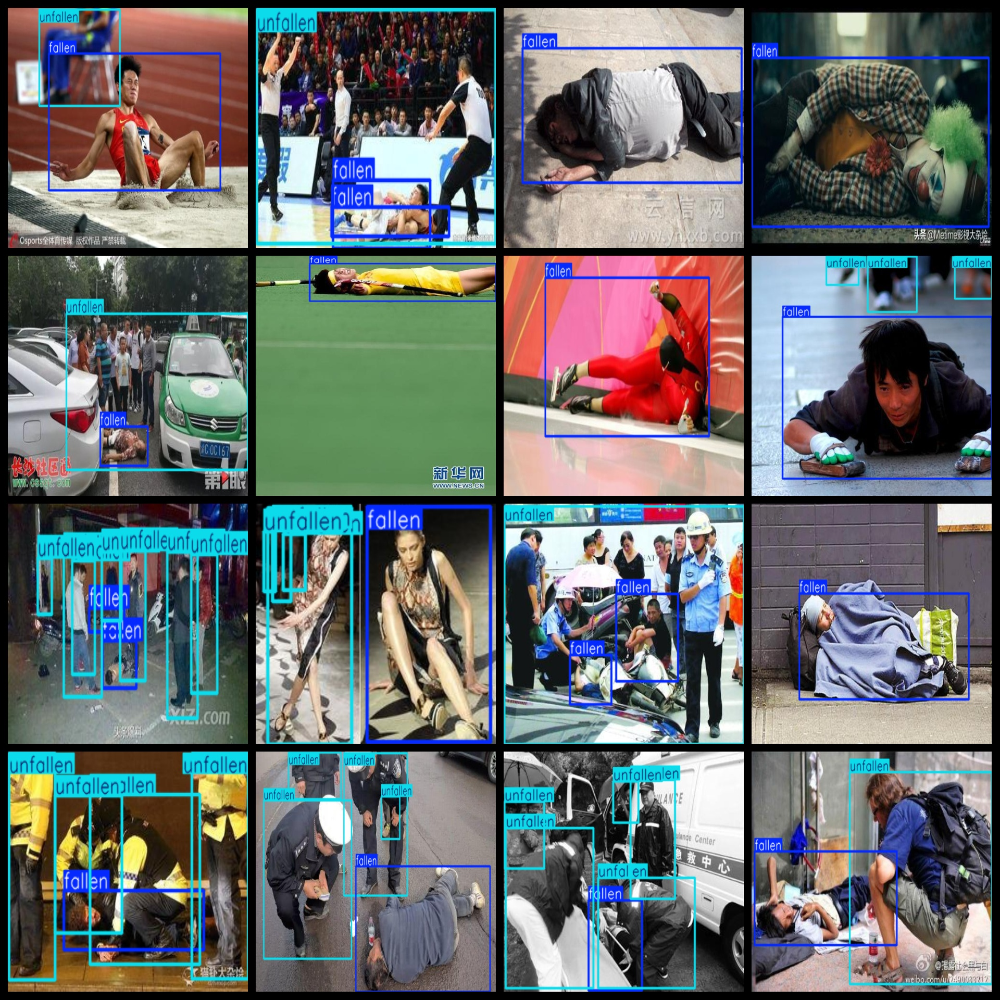
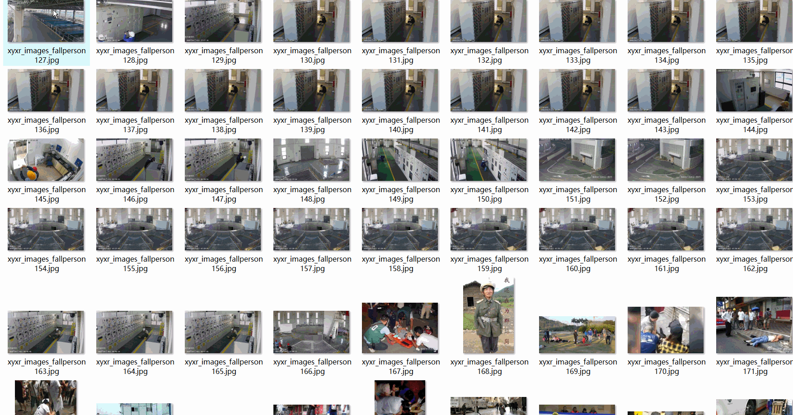

# Fall Detection Dataset 7897 imagesVOC+YOLO format

The dataset for fall detection includes 7897 VOC+YOLO format images.

Dataset format: Pascal VOC format + YOLO format (the txt file does not contain the split path, it only contains jpg images and corresponding VOC format xml files and yolo format txt files)

Number of images (number of jpg files): 7897

Number of xml files: 7897

Number of txt files: 7897

Label count: 2

The Github repository is: datasets_sl

["fallen", "unfallen"]

Number of boxes labeled in each category:

Fallen frames = 9025

The number of unfallen frames is 22380.

Total Frames: 31405

Number of images per category:

Fallen's possession count = 7167

Unfallen has 6362 images.

Image resolution: Multi-resolution images, such as 500x327, 900x599, etc.

Use the labeling tool: labelImg

Dataset Augmentation: No

Rules for annotation: Draw a rectangle around the category.

Important note: The dataset does not have been divided into training, validation, and testing sets.

Special Disclaimer: This dataset does not guarantee the accuracy of the trained models or weight files.

Annotation and image details are as follows:

## Images

---

Here is a pay link on Stripe (https://buy.stripe.com/3cs8yP7sY87d0vu9AB). Please contact me lonlonago@foxmail.com after funding $89, and I will send you a complete data files, thank you!

